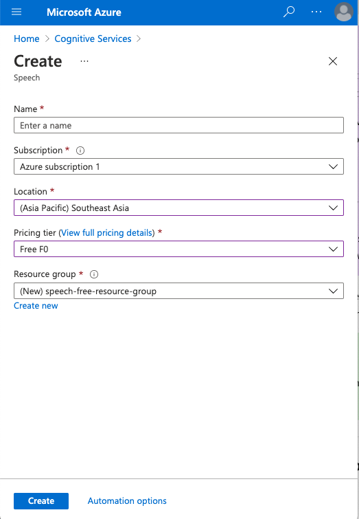
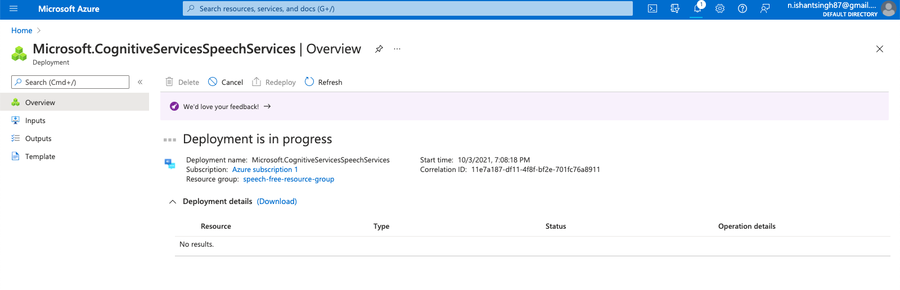
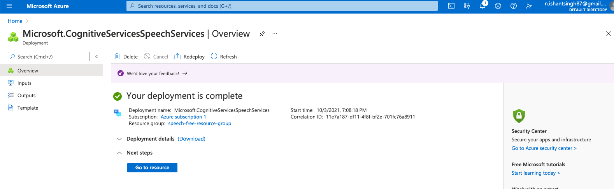
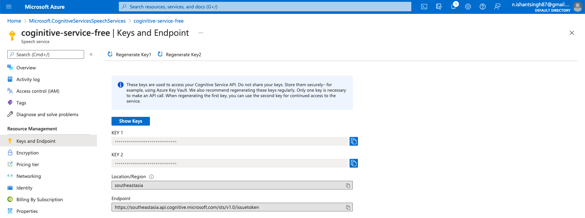

### Create a Cognitive Service Subscription on Azure

- On Azure Portal Search for 

- Create a Coginitive Speech subscription : 

  

- Wait for deployment to finish : 

  

- When done, click on go to resource : 

  

- Open the `Keys and Endpoint` tab 

  


### Install the npm module

- Create project and add client lib

  ```
  yarn init
  yarn add microsoft-cognitiveservices-speech-sdk
  ```

  

- Get a sample `.wav` file and put it in directory `audio/my-audio-file-1.wav`

- Get you key : 

  ```yaml
  // Its an invalid key, get you own using steps in last section
  key: c072d816c3dc4e34a8d1571d4d25e986
  endpoint: https://southeastasia.api.cognitive.microsoft.com/sts/v1.0/issuetoken
  ```

- Create a `index.js` and a start script in`package.json`

  ```
    "scripts": {
      "start": "node index.js"
    },
  ```

-  Create `index.js`

  ```javascript
  const fs = require('fs');
  const sdk = require("microsoft-cognitiveservices-speech-sdk");
  
  // Its okay, you can steal it. Its a free subscription that is already deleted.
  const speechConfig = sdk.SpeechConfig.fromSubscription(
    "c072d816c3dc4e34a8d1571d4d25e986",
    "southeastasia");
  
  const fromFile = () => {
    const audioConfig = sdk.AudioConfig.fromWavFileInput(
      fs.readFileSync("audio/my-audio-file-1.wav"));
    
    const recognizer = new sdk.SpeechRecognizer(speechConfig, audioConfig);
  
    recognizer.recognizeOnceAsync(result => {
      if(!result.text){
        console.log(result.privErrorDetails);
      }
      console.log(`RECOGNIZED: Text=${result.text}`);
      recognizer.close();
    });
  }
  fromFile();
  
  ```

  


Sources: 

- https://microsoftlearning.github.io/AI-102-AIEngineer/Instructions/07-speech.html
- https://docs.microsoft.com/en-us/azure/cognitive-services/speech-service/get-started-speech-to-text?tabs=windowsinstall&pivots=programming-language-nodejs

